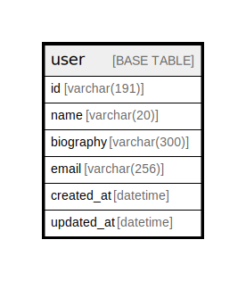

# user

## Description

user table

<details>
<summary><strong>Table Definition</strong></summary>

```sql
CREATE TABLE `user` (
  `id` varchar(191) NOT NULL COMMENT 'ID is user id. ULID（Universally Unique Lexicographically Sortable Identifier）',
  `name` varchar(191) NOT NULL COMMENT 'Name is user name',
  `created_at` datetime NOT NULL COMMENT 'CreatedAt is the date that record was created',
  `updated_at` datetime NOT NULL COMMENT 'UpdatedAt is the date record was updated',
  PRIMARY KEY (`id`)
) ENGINE=InnoDB DEFAULT CHARSET=utf8mb4 COLLATE=utf8mb4_0900_ai_ci COMMENT='user table'
```

</details>

## Columns

| Name | Type | Default | Nullable | Children | Parents | Comment |
| ---- | ---- | ------- | -------- | -------- | ------- | ------- |
| id | varchar(191) |  | false |  |  | ID is user id. ULID（Universally Unique Lexicographically Sortable Identifier） |
| name | varchar(191) |  | false |  |  | Name is user name |
| created_at | datetime |  | false |  |  | CreatedAt is the date that record was created |
| updated_at | datetime |  | false |  |  | UpdatedAt is the date record was updated |

## Constraints

| Name | Type | Definition |
| ---- | ---- | ---------- |
| PRIMARY | PRIMARY KEY | PRIMARY KEY (id) |

## Indexes

| Name | Definition |
| ---- | ---------- |
| PRIMARY | PRIMARY KEY (id) USING BTREE |

## Relations



---

> Generated by [tbls](https://github.com/k1LoW/tbls)
